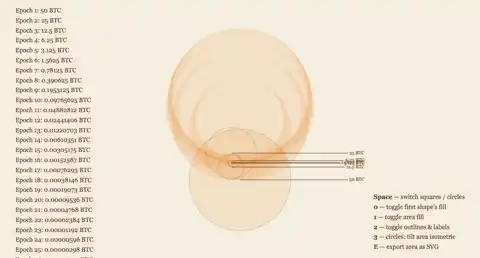
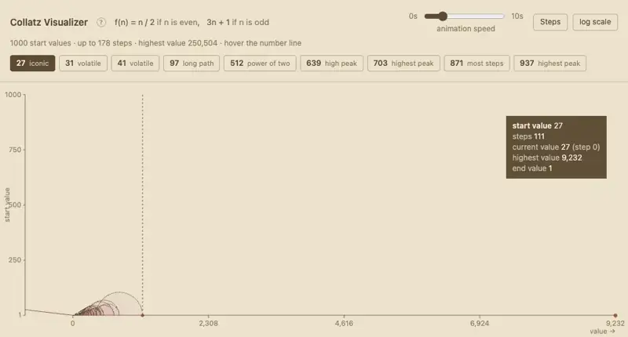
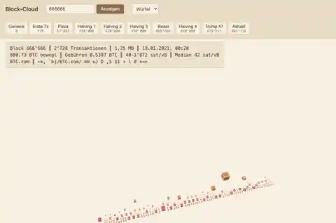

```
██████╗ ██████╗  █████╗ ██╗███╗   ██╗
██╔══██╗██╔══██╗██╔══██╗██║████╗  ██║
██████╔╝██████╔╝███████║██║██╔██╗ ██║
██╔══██╗██╔══██╗██╔══██║██║██║╚██╗██║
██████╔╝██║  ██║██║  ██║██║██║ ╚████║
╚═════╝ ╚═╝  ╚═╝╚═╝  ╚═╝╚═╝╚═╝  ╚═══╝
═════════════ f a r t s ═════════════
```

Just my creative ideas that I can't put anywhere else. Enjoy.

Mostly self-contained, no build step. Open the HTML file and it runs,
or try the live versions: **<https://tlausz.github.io/Playground/>**

## What's in here

<table>
<tr>
<td colspan="2" valign="top">
  <a href="Pool%20Caustics/">
    
  </a>
  <h3><a href="Pool%20Caustics/">Pool Caustics</a></h3>
  <p>
    The light reflections drifting across a swimming pool surface,
    recreated in a single HTML file.<br>
    readme: <a href="Pool%20Caustics/README.md">/Pool Caustics/README.md</a><br>
    live: <a href="https://tlausz.github.io/Playground/Pool%20Caustics/">/Pool Caustics/</a>
  </p>
</td>
</tr>
<tr>
<td colspan="2" valign="top">
  <a href="MJzoom01/">
    
  </a>
  <h3><a href="MJzoom01/">Whackaddodle MJ zoom</a></h3>
  <p>
    Midjourney zoom-out steps stitched back into one continuous camera move.<br>
    readme: <a href="MJzoom01/README.md">/MJzoom01/README.md</a><br>
    live: <a href="https://tlausz.github.io/Playground/MJzoom01/">/MJzoom01/</a>
  </p>
</td>
</tr>
<tr>
<td colspan="2" valign="top">
  <a href="Wave%20Function%20Collapse/">
    
  </a>
  <h3><a href="Wave%20Function%20Collapse/">Wave Function Collapse</a></h3>
  <p>
    A tile map that builds itself: the least certain cell picks a tile, the
    constraint propagates, and the grid settles on squares, on hexagons, or
    wrapped around a globe.<br>
    readme: <a href="Wave%20Function%20Collapse/README.md">/Wave Function Collapse/README.md</a><br>
    live: <a href="https://tlausz.github.io/Playground/Wave%20Function%20Collapse/">/Wave Function Collapse/</a>
  </p>
</td>
</tr>
<tr>
<td colspan="2" valign="top">
  <a href="bitcoin-halving-animation/">
    
  </a>
  <h3><a href="bitcoin-halving-animation/">Bitcoin Halving Animation</a></h3>
  <p>
    Eight nested shapes for the block-reward epochs, hinged in a chain that
    opens and folds back. Squares hinge at a corner, circles where they touch;
    the area underneath traces every rotation, so the overlaps darken toward
    the centre.<br>
    readme: <a href="bitcoin-halving-animation/README.md">/bitcoin-halving-animation/README.md</a><br>
    live: <a href="https://tlausz.github.io/Playground/bitcoin-halving-animation/">/bitcoin-halving-animation/</a>
  </p>
</td>
</tr>
<tr>
<td colspan="2" valign="top">
  <a href="collatz-visualizer/">
    
  </a>
  <h3><a href="collatz-visualizer/">Collatz Visualizer</a></h3>
  <p>
    The Collatz sequences for the start values 1 to 1000. Hover the number line
    to pick one and watch it hop (halve when even, triple and add one when odd)
    until it lands on 1.<br>
    readme: <a href="collatz-visualizer/README.md">/collatz-visualizer/README.md</a><br>
    live: <a href="https://tlausz.github.io/Playground/collatz-visualizer/">/collatz-visualizer/</a>
  </p>
</td>
</tr>
<tr>
<td colspan="2" valign="top">
  <a href="block-cloud/">
    
  </a>
  <h3><a href="block-cloud/">Block-Cloud</a></h3>
  <p>
    A Bitcoin block as a 3D city: one cube per transaction, sized by how much
    room it takes in the block and coloured by its fee rate. Type a height, or
    take one of the presets: the genesis block, the pizza block, the halvings.<br>
    readme: <a href="block-cloud/README.md">/block-cloud/README.md</a><br>
    live: <a href="https://tlausz.github.io/Playground/block-cloud/">/block-cloud/</a>
  </p>
</td>
</tr>
</table>
