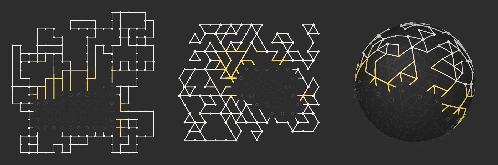

# Wave Function Collapse

[`index.html`](index.html) is a tile map that builds itself. Every cell starts
out as *every* tile at once; the least certain cell picks one, the choice
propagates to its neighbours, and the whole grid settles into a pattern that is
random but never breaks its own rules. Open it in a browser; no dependencies,
nothing to build.

Three lattices, same algorithm: **square** draws the classic pipe grid,
**hexagon** runs the identical rules on a honeycomb, where six edges per cell
turn the pipes into lace, and **sphere** wraps the whole thing around a globe
you can spin. Switch with the buttons or `G`. The choice sits in the fragment,
`index.html#sphere`, so a bookmark comes back to the lattice it was made on.

## How it works

A tile is nothing but a pattern of pipes leaving through its edges. Two cells
fit together when the edge they share reads the same on both sides: a pipe
never runs into a blank wall. That single rule generates the tile set: every
combination of edges is a tile, minus the ones with a single pipe, because a
pipe that just stops looks like a mistake. Four edges give 12 tiles, five give
27, six give 58.

Each cell holds the set of tiles it could still become. One step of the loop:

1. **Observe:** find the cell with the fewest options left, ties broken at
   random so the front stays organic rather than sweeping top-left to
   bottom-right.
2. **Collapse:** pick one of its tiles, weighted, and throw the rest away.
3. **Propagate:** a cell only ever tells its neighbour which values the shared
   edge may still take. If both 0 and 1 are still on the table, nothing is
   constrained and the neighbour is skipped; otherwise the neighbour loses every
   tile that disagrees, and the shrinking travels on from there.

Propagation can paint the grid into a corner: a cell whose four neighbours have
already decided may have no tile left that fits. The solver keeps a trail of
every removal and a stack of its guesses, so a contradiction rewinds to the last
guess, drops that tile, and tries the next one. Only when the stack runs dry
does it give up and reseed.

The gold is the collapse front. A cell is drawn gold the moment it settles and
cools to off-white over about a second, so the picture shows where the algorithm
is working, not just what it produced. Cells that are still undecided show a
ring that tightens as their options run out.

Two smaller details: the border is sealed, so no pipe leaves the grid, which is
what makes the map read as an object rather than a crop; and the map is drawn
from a seed, so the same seed always redraws the same map.

## The sphere

A sphere cannot be tiled with hexagons alone. Euler's formula leaves exactly
twelve pentagons no matter how fine the mesh gets: the same twelve a football
has. So the globe mixes both, and the pentagons each draw from their own set of
27 tiles.

The cells are the vertices of a subdivided icosahedron: the twelve original
corners keep five neighbours, everything else gets six. Building it that way
means the solver has to give up two assumptions that hold on a flat grid: that
every cell has the same number of edges, and that the edge facing back is always
the opposite one. There is no "opposite" on a sphere, so every edge stores which
edge of its neighbour it meets. With that pairing in hand the observe-propagate
loop is unchanged; it never learns which lattice it is running on.

The very first step of the subdivision slider is a special case. Subdividing
gives 10f²+2 cells (42, 92, 162), so the 32 of a real football are not in that
series at all. A football is the icosahedron truncated rather than subdivided:
its cells are the twelve corners plus the twenty face centres, a corner meeting
the five faces around it and a centre meeting its three corners and three
sibling centres. Same five-or-six neighbours, so the solver never notices.

Points shared between two faces of the icosahedron are matched by integer
barycentric coordinates rather than by rounded floats, so neighbouring faces
really agree on a cell instead of leaving a hairline seam.

Pipes are drawn as short arcs following the surface. The far side shows through
faintly and cells dim towards the limb, which is what makes it read as a ball
rather than a disc. Drag to turn it; it drifts on its own otherwise.

## Taking the ball apart

Tick **Lift the shapes** and the globe comes apart into the shapes its own pipes
cut out. A shape is whatever the pipes enclose: mostly irregular, running across
as many cells as the pipes let it, and at its smallest a single triangle between
three junctions. Bigger shapes sink towards the centre, smaller ones rise, over
five steps. The sizes are ranked on a log scale first, because one shape can
cover half the globe while two dozen others are corner triangles and spreading
those by their raw size would flatten every triangle onto one value; the five
steps then stop a hundred shapes from each hovering at a height of their own,
which reads as noise.

Finding the shapes takes union-find and nothing else. Each cell is cut into
wedges, one per corner. A pipe leaving through an edge walls off the two wedges
either side of it, but the edge itself is never a wall: a pipe only reaches as
far as the edge midpoint, so both halves of the edge stay open and a shape
wraps round the corner into the next cell. Two checks pin the rule down. A
globe with no pipes at all has to come out as one shape, and one where every
edge carries a pipe has to give a triangle per corner, which on a sphere is
2n-4 of them.

Wedges also settle the question of how a shape spanning several cells can sit
on a curved surface: each wedge is projected on its own, so the shape bends
along the cell edges it crosses instead of having to stay flat.

A shape is a solid, not a floating plate: its cap sits at its own radius and a
wall closes the step down to each shape beside it. The step is the thing:
a wall spans from one shape's radius to its neighbour's, and only the higher of
the two draws it. Carrying both down to the sphere instead would stack two
walls in two colours where one face belongs, which is what a wall in a single
shade looks like when it is really two. Shapes at the same height share no step
and get no wall.

The wall normal is horizontal and square to the pipe above it, so a fixed
light (held in camera space, so the globe turns under it rather than carrying
it along) shades each wall by which way it faces. Where a shape turns a corner
its walls meet at around 120 degrees, so the two really are different faces and
take different shades.

The caps are shaded by a gradient rather than a value of their own. A cell has
one normal, so all six of its wedges come out at the same brightness and every
cell draws itself as a hexagon across the shading. A gradient lets the light
fall through the faces instead. Its stops trace sqrt(1 - (r/R)^2), the lambert
term at image distance r from the point facing the light: exact while that
point sits at the centre of the picture, stretching to an ellipse as it moves
off, and near enough by eye. Shading it properly would take per-vertex colours,
which Canvas cannot fill.

Caps and walls go into one list and are painted back to front, and nothing is
dropped for facing away or for sitting behind the horizon. The sort key is the
angle of a face's direction from the view axis, not the depth of a point on it,
and that key is exact rather than heuristic: the solid is star-shaped about the
centre, and along any ray from the eye the angle grows strictly monotonically,
so the nearer of two hits is always the one at the smaller angle. Depth keys
are what flickered here twice. The depth of a face's midpoint carries its
radius, so a raised face's key overtakes faces that actually stand in front of
it, and rotation makes the keys cross back and forth, which pops the paint
order. The angle ignores the radius entirely, so heights can never reorder. Culling either way
makes faces blink out as the globe turns them past the threshold, and a shape
standing off the ball genuinely does show over the silhouette, so there is
nothing to cull. The core is painted where the list crosses the horizon, which
leaves it covering what is behind it and no more.

That core sits at the radius of the deepest shape, not at the sphere's own. At
the sphere's radius its rim shows between the shapes that sank below it and the
ones that rose above, as a dark band running round the globe where nothing is
drawn at that radius. Tucked under the deepest shape it never shows. Faces no
further out than the core are the one thing skipped once they are behind it,
since those project inside its silhouette and no part of them could show.
Sampling the canvas over 24 camera positions, nothing inside the core's outline
is left uncovered.

Lifted, the pipes are gone from the surface, and nothing redraws them: a pipe
between two shapes at different heights has two places it could be, and drawn
on the ball it would lay lines across the shapes rather than around them. A
shape's edge is the step itself, the wall and the change of shade, the way a
paper model needs no ink along its folds. A pipe with the same shape on both
sides carries no wall either: it is a spur reaching into a shape, not an edge
of one.

The caps take their colour from a height ramp, deep shapes a dark slate and
raised ones a near-white stone, and the light is two tinted sources rather
than one grey factor, which is what daylight is: the ambient fill is the sky,
faintly blue, and it is all a shadowed face gets, so shadows cool off; the key
light is warm white, and at full strength the two sum to just about neutral.

## Controls

Press `H` or the ☰ button for the panel.

| Control | What it does |
| --- | --- |
| Square / Hexagon / Sphere | Which lattice to collapse on |
| Grid, Subdivision | Cells per side, or how often the icosahedron is split; the lowest step on the sphere is the 32-cell football |
| Speed | Collapses per frame |
| Blanks | How strongly empty tiles are favoured: high leaves islands, 0 fills the grid |
| Junctions | Weight of tees and crosses, the tiles that make pipes branch |
| Line width | Thickness of the pipes |
| Lift the shapes | Stand the shapes off the sphere as solids, by their size (sphere only) |
| Seal the border | Forbid pipes that would leave the grid (a sphere has no border) |
| Show uncertainty | Draw the undecided cells |
| Restart when done | Reseed a moment after the map settles |

`Space` pauses, `R` reseeds, `G` cycles the lattice, `F` goes fullscreen. The
panel also reports the seed, how many cells are still open, and how often the
solver had to backtrack.

## Origin

Ported from a p5.js sketch of the same idea: a React component with a
12-tile pipe set on a fixed 16×16 grid. This version drops the framework and p5
for plain Canvas 2D in one file, and generalises the solver until the lattice
(flat or wrapped around a globe, four edges or five or six) is just a parameter.
