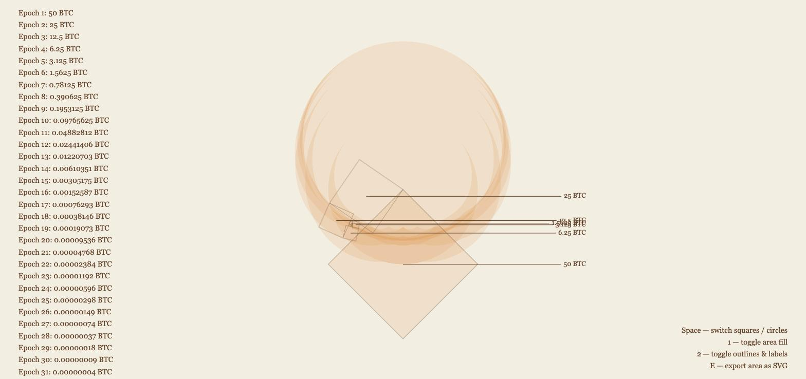
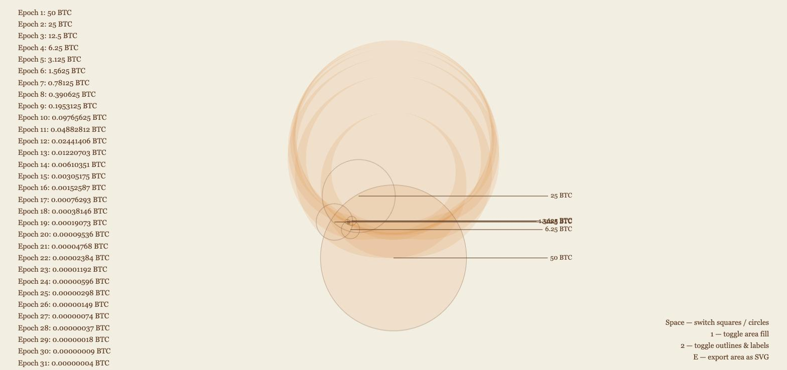

# Bitcoin Halving Animation

A browser animation of the Bitcoin halving cycle. Eight nested shapes stand for the block-reward epochs (50, 25, 12.5, ... 0.390625 BTC), each hanging off the next smaller one like a chain of hinges, opening from a closed, nested position and back.

Two scenes, switched with the space bar: squares (hinged at a corner) and circles (hinged at the tangent point where two shapes touch). A static area fill underneath traces each shape's full rotation as a disc, so overlapping shapes darken toward the centre — a bullseye.

| Squares | Circles |
|---|---|
|  |  |

Open `index.html` in a browser, no server or build step needed.

## Controls

| Key | Action |
|---|---|
| **Space** | switch squares / circles |
| **0** | toggle first shape's fill |
| **1** | toggle area fill |
| **2** | toggle outlines & labels |
| **E** | export the active scene's area as a standalone SVG |

## Files

- `index.html` — the whole thing.
- `gen-svg.js` — regenerates the exported SVGs from the command line (`node gen-svg.js <output-dir>`).
- `flaeche-quadrate.svg`, `flaeche-kreise.svg` — the area fill as editable vector paths.
- `DESIGN.md` — colours, typography, motion tokens.

---

Built with [Claude Code](https://claude.com/claude-code). #vibecoding
