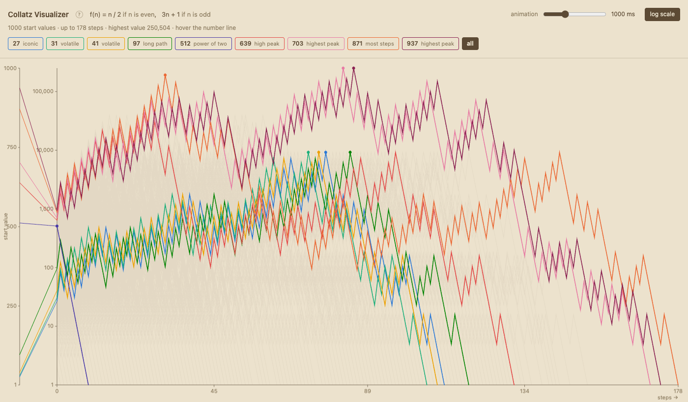

# Collatz Visualizer

Live demo: https://tlausz.github.io/Playground/collatz-visualizer/

An interactive view of the Collatz sequences for the starting values 1 to N.
Hover the number line on the left to pick a start value, or use the quick-pick
buttons under the title. Two views, switched by the Circles/Steps button: the
default circles view lays the values on a horizontal axis and draws each hop as
a half-circle rising from it; the steps view draws the value over the step count
as a line with dotted guides at the current step and the highest value so far.

The Collatz rule: for a positive integer `n`, take `n / 2` when `n` is even and
`3n + 1` when it is odd, then repeat. Every sequence tested so far ends at 1.



## Open questions

The conjecture says every positive integer eventually reaches 1. Nobody has
proven this for all integers, and it has resisted proof since Lothar Collatz
posed it in 1937. Jeffrey Lagarias called it "an extraordinarily difficult
problem, completely out of reach of present day mathematics."

What is known:

- **Computational verification.** All starting values up to 2^71 (about
  2.36 × 10^21) have been checked and confirmed to reach 1. That covers this
  project's range many times over, but a finite check can never rule out a
  counterexample further out.
- **Terence Tao's 2019 result.** Tao proved that almost all Collatz orbits
  (in a precise logarithmic-density sense) eventually descend below any
  function that diverges to infinity, no matter how slowly. It is one of the
  strongest partial results to date, but it stops short of a full proof.
- **No known cycles other than 1 → 4 → 2 → 1**, and no proof that one cannot
  exist.

Sources: [Collatz conjecture, Wikipedia](https://en.wikipedia.org/wiki/Collatz_conjecture),
[Tao, "Almost all Collatz orbits attain almost bounded values" (2019)](https://arxiv.org/abs/1909.03562),
[Quanta Magazine on Tao's result](https://www.quantamagazine.org/mathematician-proves-huge-result-on-dangerous-problem-20191211/).

## Two viewers

There are two HTML files with the same viewer. They differ only in how they
load the data.

- **`index.html`**: standalone. The data is embedded in the file, so it opens
  with a double-click (`file://`), no server needed.
- **`index-csv.html`**: loads `data/collatz.csv` at runtime via `fetch`.
  Browsers block `fetch` on `file://`, so this one needs a local server or a
  host such as GitHub Pages. It reads whatever range the CSV holds, so it suits
  larger N than the embedded page.

Run the fetch version locally:

```
python3 -m http.server
```

Then open `http://localhost:8000/index-csv.html`. On GitHub Pages both files
work, since the pages are served over HTTP.

## Controls

- **Circles / Steps:** switch the view. Circles (default) lays the values on a
  horizontal axis and draws each hop as a half-circle rising from it. Steps is
  the classic value-over-step line. The button shows the view you switch to.
- **Number line (left):** hover to select a start value and draw its sequence.
- **Quick-pick buttons:** nine noteworthy start values; a click selects one and
  starts the animation. The active one is highlighted.
- **all:** (Steps view only) draws all nine quick-pick sequences at once, each in
  its own colour, with a matching colour frame on its button. A single-value
  click or a ruler hover leaves this view.
- **Plot area:** with a sequence selected, move along it to read the value at the
  nearest point (shown as "current value" in the tooltip).
- **animation speed slider:** set how long a selected sequence takes to draw,
  from 0s (instant) to 10s. Default 3s.
- **log scale:** switch the value axis between linear and logarithmic. Starts
  linear. Log is fixed at the global maximum so runs stay comparable; linear
  fits the selected run's own peak, so small start values fill the width.

## Data

`data/collatz.csv` holds one row per start value:

```
n,steps,max,sequence
27,111,9232,"27,82,41,124,62,31,94,47,142,71,...,2,1"
```

- `n`: the start value
- `steps`: number of steps until it reaches 1
- `max`: highest value in the sequence
- `sequence`: the full path, comma-separated, in quotes

The end value is always 1, so it has no column of its own.

## Changing the range

The range is set by one script. To compute a different range, pass N:

```
python3 scripts/generate_data.py 5000
```

This writes `data/collatz.csv` for 1..5000 and re-embeds the same data into the
standalone `index.html`, so both viewers stay in sync. Without an argument it
uses N = 1000.

Larger ranges make `index.html` heavier, because the data lives inside it. For
very large N, prefer `collatz-csv.html`, which only reads the CSV.

If you would rather embed the data by hand, paste the CSV content between the
tags of the `<script id="csvdata" type="text/csv"> … </script>` block near the
top of `index.html`.

## Design

The look follows `DESIGN.md`: a single warm brown-and-beige family, like an old
topographic survey map. The thousand faint sequence paths sit behind the
selected one like contour lines. Tokens in `DESIGN.md` take precedence over ad
hoc choices.

## Structure

```
collatz-visualizer/
├── index.html            standalone viewer, opens by double-click
├── index-csv.html        viewer that loads data/collatz.csv
├── data/collatz.csv      precomputed sequences, 1..N
├── scripts/
│   └── generate_data.py  computes the CSV and re-embeds it into index.html
├── docs/all-view.png     screenshot used in this README
├── DESIGN.md             visual identity
└── README.md
```

## Credits

Built with [Claude](https://claude.ai) (Claude Code).
